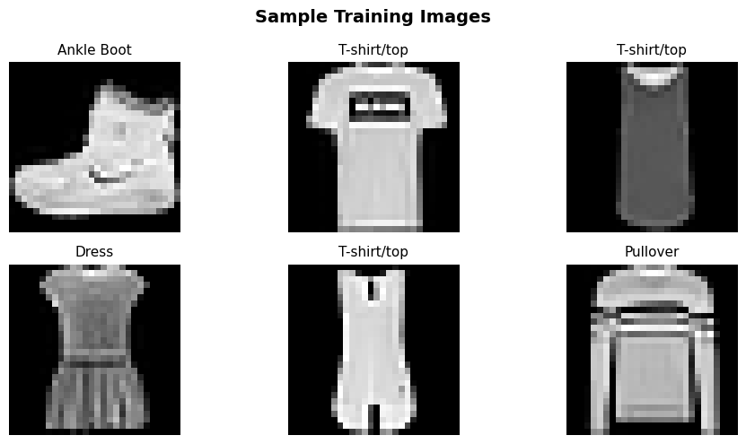
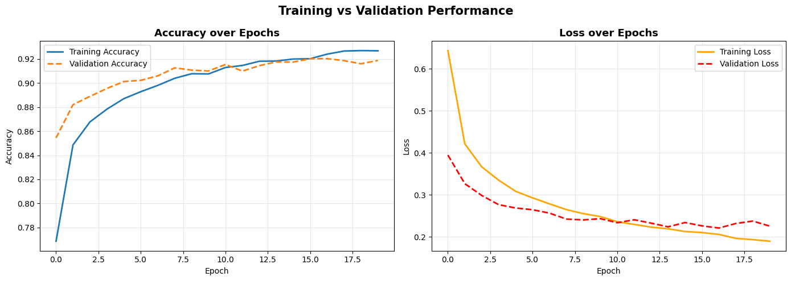
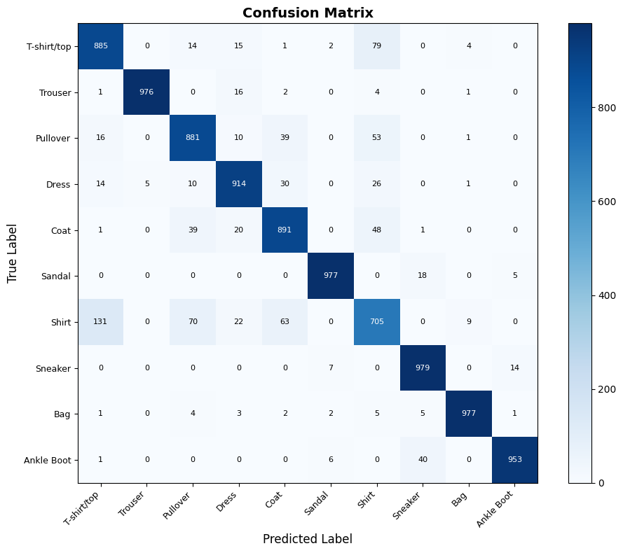
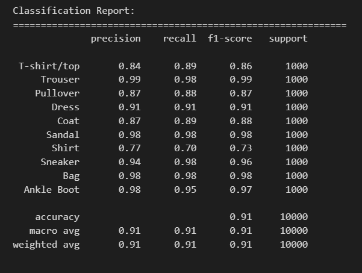
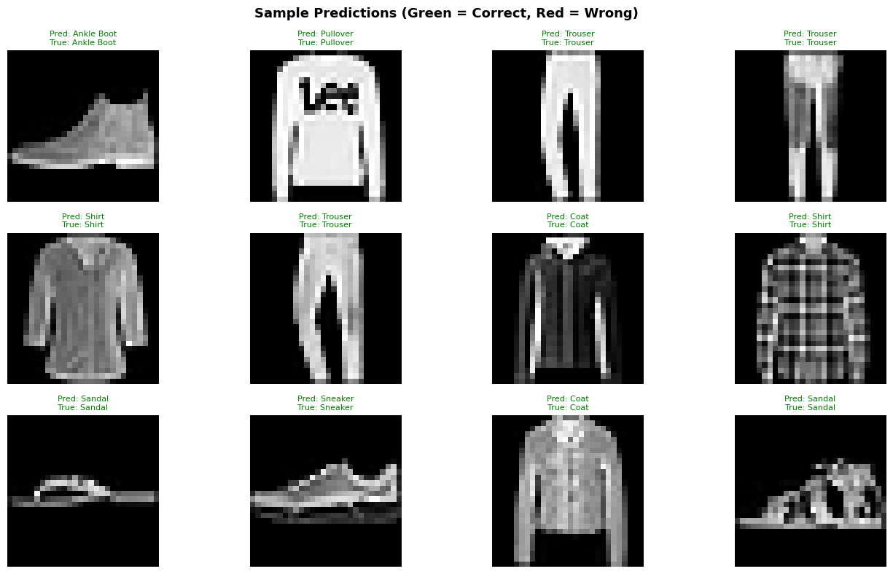

# Fashion MNIST Image Classification using CNN

A Convolutional Neural Network (CNN) built with TensorFlow/Keras to classify clothing items from the **Fashion MNIST** dataset into 10 categories — achieving **91% test accuracy**.

---

## 📁 Project Structure

```
fashion-mnist-cnn/
│
├── fashion_mnist_cnn.ipynb   # Main Jupyter Notebook (fully commented)
├── fashion_mnist_cnn.h5      # Saved trained model (generated on run)
├── README.md                 # Project documentation
├── requirements.txt          # Python dependencies
└── screenshots/
    ├── sample_images.png
    ├── training_curves.png
    ├── confusion_matrix.png
    ├── classification_report.png
    └── predictions.png
```

---

## 📌 About the Dataset

The [Fashion MNIST](https://github.com/zalandoresearch/fashion-mnist) dataset contains **70,000 grayscale images** (28×28 pixels) across 10 clothing categories:

| Label | Class | Label | Class |
|-------|-------|-------|-------|
| 0 | T-shirt/top | 5 | Sandal |
| 1 | Trouser | 6 | Shirt |
| 2 | Pullover | 7 | Sneaker |
| 3 | Dress | 8 | Bag |
| 4 | Coat | 9 | Ankle Boot |

### Sample Training Images



---

## 🧠 Model Architecture

```
Input (28×28×1)
    → Conv2D(32, 3×3, ReLU)       # Detect edges and textures
    → MaxPooling2D(2×2)            # Reduce spatial dimensions
    → Conv2D(64, 3×3, ReLU)       # Detect higher-level patterns
    → MaxPooling2D(2×2)
    → Dropout(0.25)                # Regularization
    → Flatten
    → Dense(128, ReLU)
    → Dropout(0.5)                 # Stronger regularization
    → Dense(10, Softmax)           # Output: 10 class probabilities
```

**Optimizer:** Adam | **Loss:** Sparse Categorical Crossentropy | **Metric:** Accuracy

---

## 📋 Tasks Breakdown

| Task | Description |
|------|-------------|
| Task 1 | Data loading, normalization `[0,1]`, reshaping to `(28,28,1)` |
| Task 2 | CNN architecture design with Conv, Pooling, Dropout layers |
| Task 3 | Training with Early Stopping (patience=3) + training curve plots |
| Task 4 | Evaluation — test accuracy, annotated confusion matrix, classification report |
| Task 5 | Visual predictions with color-coded correct/incorrect labels |

---

## 📊 Results

### Training Curves



> Training accuracy steadily increases to **~92%** while validation accuracy tracks closely at **~91%** — indicating the model generalises well with no significant overfitting.

---

### Confusion Matrix



> The diagonal is strongly dominant. The most confused pair is **Shirt ↔ T-shirt/top** and **Shirt ↔ Pullover** — understandable given their visual similarity as upper-body garments.

---

### Classification Report



| Class | Precision | Recall | F1-Score |
|-------|-----------|--------|----------|
| T-shirt/top | 0.84 | 0.89 | 0.86 |
| Trouser | 0.99 | 0.98 | 0.99 |
| Pullover | 0.87 | 0.88 | 0.87 |
| Dress | 0.91 | 0.91 | 0.91 |
| Coat | 0.87 | 0.89 | 0.88 |
| Sandal | 0.98 | 0.98 | 0.98 |
| **Shirt** | **0.77** | **0.70** | **0.73** |
| Sneaker | 0.94 | 0.98 | 0.96 |
| Bag | 0.98 | 0.98 | 0.98 |
| Ankle Boot | 0.98 | 0.95 | 0.97 |
| **Overall** | **0.91** | **0.91** | **0.91** |

> **Shirt** is the hardest class to predict (F1: 0.73) due to visual overlap with T-shirt/top and Pullover. All other classes score above 0.86.

---

### Sample Predictions



> Green = Correct prediction, Red = Wrong prediction

---

## ✅ Key Features

- **Early Stopping** — monitors validation loss, stops training automatically to prevent overfitting
- **Model Saving** — trained model saved as `.h5` for reuse without retraining
- **Annotated Confusion Matrix** — cell values shown for easy interpretation
- **Color-coded Predictions** — green = correct, red = incorrect
- **Clean, commented code** — each decision explained inline

---

## 🚀 How to Run

1. **Clone the repository**
   ```bash
   git clone https://github.com/YOUR_USERNAME/fashion-mnist-cnn.git
   cd fashion-mnist-cnn
   ```

2. **Install dependencies**
   ```bash
   pip install -r requirements.txt
   ```

3. **Open the notebook**
   ```bash
   jupyter notebook fashion_mnist_cnn.ipynb
   ```

4. Run all cells from top to bottom. The trained model will be saved as `fashion_mnist_cnn.h5`.

---

## 🛠️ Requirements

- Python 3.8+
- TensorFlow 2.x
- NumPy
- Matplotlib
- scikit-learn

---

## 👤 Author

**Your Name**  
Department of [Your Department]  
[Your University / Institution]
